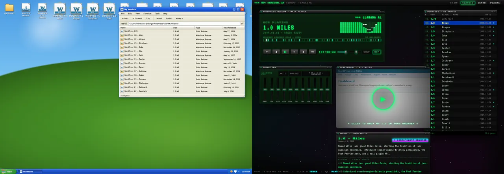

# WordPress Museum

A monorepo of independent WordPress museum experiences. Each experience owns its
interface, assets, data, and any tools it needs. The repository provides shared
preview, checks, static packaging, and a thin WordPress routing adapter.

| Experience | Local preview | Description |
| --- | --- | --- |
| [Desktop](museums/desktop/) | `/desktop/` | Release history as an early-2000s desktop. |
| [Winamp](museums/winamp/) | `/winamp/` | Release history as a music-player timeline. |
| [3D Museum](museums/3d/) | `/3d/` | A walkable museum of WordPress’s first 20 years, with design explorations. |



## Structure

```text
.
├── index.html                 # Preview landing page.
├── museums.json               # Experience registry and shared public files.
├── museums/
│   ├── <slug>/
│   │   ├── museum.json        # Name and explicit list of public files.
│   │   ├── index.html         # Experience entry point.
│   │   └── ...                # Experience-owned assets, data, docs, and tools.
│   ├── data/releases.js       # Shared by Desktop and Winamp.
│   └── assets/fonts/          # Shared fonts and licenses.
├── museum.php                 # WordPress routing adapter.
├── scripts/                   # Shared preview, checks, and packaging.
└── tests/                     # Manifest, packaging, and HTTP integration tests.
```

**Experiences are independent static sites.** Shared data and assets are optional;
an experience can keep a different data model or historical scope. Put resources
in the shared directories only when multiple experiences use them. Keep
experience-specific scripts and dependencies inside its directory. A package
manager workspace is not required for these dependency-free projects.

There is no frontend compilation step. Packaging copies the published files
unchanged into `_site/`, with the `museums/` source directory omitted from public
paths. If an experience later needs compilation, keep that build inside the
experience and integrate its output with the public file contract.

## Local development

Use Node.js 22 or newer and PHP 7.4 or newer. No dependency installation is needed.
Run these commands from the repository root:

```bash
sfw npm start
sfw npm run check
sfw npm run package
```

Open <http://127.0.0.1:4173/>. Set `PORT` to change the preview port. The preview
server serves only published files and supports cross-origin Blueprint requests.
The checks validate public references and JavaScript syntax, then test packaging
and the WordPress adapter through a small WordPress test fixture. They do not
replace testing the plugin on a real WordPress site.

## Public files and URLs

`museums.json` registers experience slugs and shared files. Each experience's
`museum.json` lists its public files relative to that directory. **These manifests
are the publishing contract** for local preview, GitHub Pages, and WordPress.
Source files, package metadata, and development tools are private unless listed.
Include required credits and asset licenses in the public file list.

| Environment | Experience URL | Shared data URL |
| --- | --- | --- |
| Local preview | `/<slug>/` | `/data/releases.js` |
| GitHub Pages | `/museum/<slug>/` | `/museum/data/releases.js` |
| WordPress Museum site | `/museum/<slug>/` | `/museum/data/releases.js` |

The `museums/` directory organizes source files only; it is not part of the public
URL. Old experience links redirect to the shorter URLs: `/museums/<slug>/` in
local preview and `/museum/museums/<slug>/` on GitHub Pages. GitHub Pages uses
HTML redirect pages that preserve query parameters and fragments when JavaScript
is enabled.

Use relative asset references so all three deployments work. Directory entry
points redirect to a trailing slash and preserve query parameters. WordPress
refreshes its rewrite rules when the manifest route list changes.

WordPress caches shared release data, JSON, images, and models for one hour, and
bundled fonts for one year. Pages, styles, and experience scripts require a fresh
response. Rename font files when their contents change so browsers use the new
version. Local preview always serves fresh files.

## GitHub Pages preview

Every push to `trunk` publishes the preview to
<https://wordpress.github.io/museum/>. Pull requests validate the static package.
The workflow runs the shared packaging script; `_site/` is generated and ignored.

## wordpress.org deployment

`https://wordpress.org/museum/` is a separate WordPress site. Its landing page
remains normal WordPress content so editors can change it without shipping code.
The full-screen experiences own their viewport and are served by `museum.php`;
they should not be pasted into Custom HTML blocks.

Production still needs coordination with the WordPress Meta team to sync this
repository as the `wporg-museum` plugin and activate it only on the Museum site.
The adapter reads committed manifests and source files directly. Do not deploy
`_site/` as the plugin: it contains only the static preview. No automatic
production deployment is configured.

## Adding an experience

1. Create `museums/<slug>/` with an `index.html` entry point and its own README.
2. Keep its assets, data, tools, and dependency declarations in that directory.
3. Add `museum.json` with a `name` and a `files` array of public relative paths.
4. Add the slug to `experiences` in root `museums.json` and link it from the preview
   index and this README.
5. Preserve source records and licenses. Register any experience-specific checks
   in the root check command and CI.
6. Run the repository checks and packaging. Test the experience in a browser,
   including keyboard, narrow-screen, and reduced-motion behavior.

Set `sharedReleases: true` in the experience manifest when its entry point uses
`../data/releases.js`; the checks then enforce the shared dataset requirements.
Do not apply those requirements to experiences with their own historical data.

## Origins and licenses

See [CREDITS.md](CREDITS.md). Repository code is licensed under GPL-2.0. Bundled
third-party assets retain their own licenses and credits.
